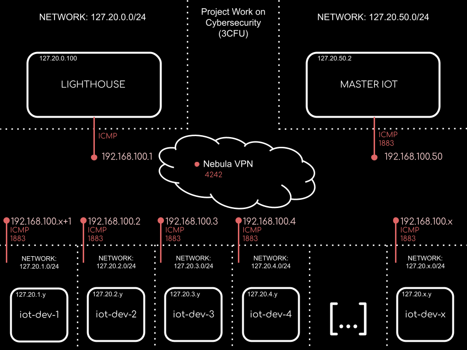

# Project Work On Cybersecurity (3CFU)

Mettere in piedi un ambiente di test moderatamente complesso che simuli un contesto industriale / CPS (Cyber Physical System) e configurato con un approccio zero trust tramite micro segmentation.

Il tool in questa repository zclod/dhall-microsegmentation ti permette di generare i file di configurazione per una rete nebula slackhq/nebula: 

Nebula: A scalable overlay networking tool with a focus on performance, simplicity and security (github.com) che si tratta di una sorta di vpn con il quale puoi implementare la micro segmentazione.

Se riesci a trovare delle immagini/container di macchine virtuali che ti rappresentano device iot/cps potresti cercare di connetterli tramite questo modo, implementare la microsegmentazione per isolarli tra di loro e testare che tutto funzioni.

## Concepts
- Cyber Physical System
- Zero Trust
- Micro-segmentation
- Nebula : https://github.com/slackhq/nebula
  - file configurazione: https://github.com/zclod/dhall-microsegmentation

## Requirements
You must have installed:
- nebula (only to produce nebula-cert)
- docker

## Network's Blueprint 
LEGEND: ``x`` is used to represent number of iot, x is parametric, and you can run the number that you want


The network used on "*bare-metal*":
- 127.20.0.100/24 (lighthouse) ``//cannot use 127.20.z.1 because is used to link virtual interface to docker network itself``
- 127.20.x.y/24 (iot-dev-x) ``//(y!=1): ip is not fixed (it is possible if we want by reintroducing commented line in the run_containers.sh part of iot-devs), they only became on a specific net``
- 127.20.50.2/24 (iot-master)

(all different networks, not a part of same subnet!)

The address configured in micro-segmented-vpn:
- 192.168.100.1 (lighthouse)
- 192.168.100.x+1 (iot-dev-1) ``//because ...1 is used for lighthouse``
- 192.168.100.2 (iot-dev-2)
- 192.168.100.3 (iot-dev-3)
- [...]
- 192.168.100.x (iot-dev-x)
- 192.168.100.50 (iot-master)

## Firewalls
I've choose to set the following configuration in device's firewall

### iot-devs:
port 1883 to communicate to master-iot in outbound communication and ``icmp`` in & out for testing nebula networking
```
outbound:
    - port: 1883
      proto: any
      host: iot-master

    - port: any
      proto: icmp
      host: any

  inbound:
    - port: any
      proto: icmp
      host: any
```
### iot-master:
Allowing inbound for mqtt port (1883)
```
outbound:
    - port: any
      proto: icmp
      host: any

  inbound:
    - port: any
      proto: icmp
      host: any
    
    - port: 1883
      proto: any
      host: any
```
### lighthouse:
And minimal protocol for lighthouse:
```
  outbound:
    # Allow all outbound traffic from this node
    - port: any
      proto: icmp
      host: any

  inbound:
    # Allow icmp between any nebula hosts
    - port: any
      proto: icmp
      host: any
```
------------------------------

## How to use
In the first run to do all automatically: (it takes some minutes also based on x) (you need to choose the x you want -> number of iot)
```bash:
./setup_env.sh x
```
--------------------------------------------------------------------------------------------------------------
After first run, if you want to resart container you can start them with that script (or manually if you want)
```bash:
./run_containers.sh
```
``run_containers.sh`` contain the leading actor (also with yml firewalls) of this project, running manually, could cause some problems. In order to understand configuration of this project a read of this script is recommended.

and if you want to rebuild them:
```bash:
./build_containers.sh
```

### NB: here we do not need to specify ``x`` because the value is saved on local file ``.nIOT``
--------------------------------------------------------------------------------------------------------
Finally to inspect that everythin is working:
```bash:
docker attach iot-master
```
or:
```bash:
docker exec -it lighthouse /bin/bash
ping 192.168.100.*x*
```
where instead of ``lighthouse`` you can change with ``iot-master`` or ``iot-dev-*``.

## Troubleshooting
### TUN/TAP on arch-linux:
i've had some problem with TUN/TAP dev since i was runningh this entire project on Arch linux, but with 
```
find /lib/modules/ -iname 'tun.ko.zst'
```
And then after finding it:
```
insmod /lib/modules/6.2.11-arch1-1/kernel/drivers/net/tun.ko.zst
```
in the end with the following command:
```
docker run
  [...]
    --device /dev/net/tun:/dev/net/tun\
  [...]
```
it is expected to work.

## Clean env
At the end of experiment, in order to clean both docker and folders:
```
./remove_all.sh
```
